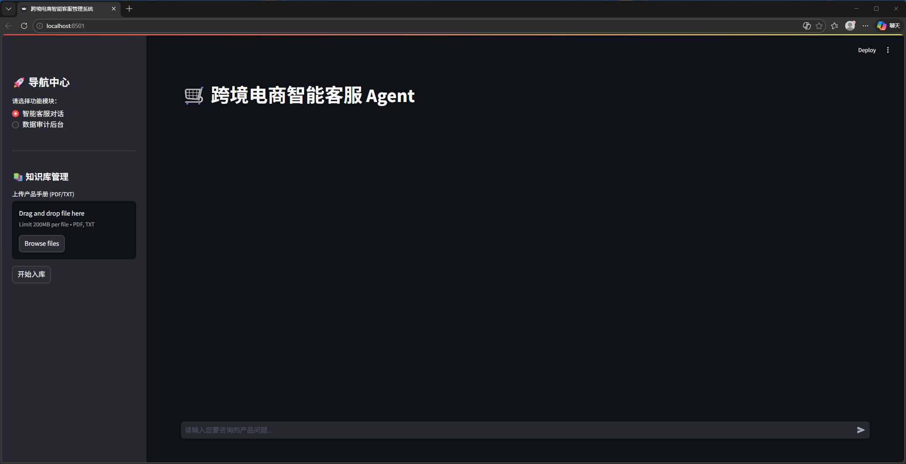

# 🤖 跨境电商智能客服 Agent (Version 2.0: 工业化重构)

[](https://www.python.org/)
[](https://fastapi.tiangolo.com/)
[](https://redis.io/)
[](https://www.mysql.com/)

> **🎯 项目定义**：本项目是一套面向高客单价跨境电商场景（如无人机、智能家居）的专业级 AI Agent 系统。
> 在 2.0 版本中，系统完成了由“单机原型”向“分布式架构”的进化，引入了三级存储模型，解决了 RAG 系统在多轮对话中的“失忆”与“检索漂移”等工业级痛点。

## 📺 功能演示 (Project Demo)

[](https://www.bilibili.com/video/BV1HoAfzFEDK/)

*👆 点击上方图片跳转至 B 站查看 2.0 版本录屏演示*


---

## 🏗️ 2.0 核心架构：三级存储与解耦分发
本项目不仅仅是 API 堆砌，其核心竞争力在于对 **“数据流”** 的精细编排：

1. **L1 (Redis) - 热记忆层**：采用异步 Redis 维护 Session 上下文，支持**无状态服务水平扩展**，并利用 TTL (Time-To-Live) 实现自动内存治理。
2. **L2 (ChromaDB) - 语义知识层**：持久化存储 1536 维产品向量索引，通过 RAG 架构实现**私有领域知识的高保真召回**。
3. **L3 (MySQL) - 持久化账本层**：基于 SQLAlchemy 异步 ORM 实现全量对话流水存证，为后续 **RLHF (基于人类反馈的强化学习)** 提供了原始语料资产。

---

## 🌟 技术攻坚亮点 (Engineering Highlights)

### 1. 🚥 基于意图路由的混合调度 (Router Pattern)
- **挑战**：RAG 无法回答知识库之外的常识，且容易受到噪音干扰。
- **解法**：自主设计了 **LLM-based Router**。在检索前对意图进行分类：涉及产品手册走本地 RAG，涉及外部新闻/常识自动触发 **Tavily Web Search**。

### 2. 🔄 多轮对话中的查询重写 (Query Transformation)
- **挑战**：用户在多轮对话中使用代词（如“它的价格？”）导致向量检索失效。
- **解法**：在 Ingestion 链路中加入 **Query Rewrite** 步骤，利用大模型结合 Redis 历史记录将用户意图“补全”为独立检索词，检索召回率显著提升。

### 3. ⚡ 全链路异步非阻塞架构
- **实现**：基于 Python **Asyncio** 协程，实现了从前端请求、大模型三步调用（Router -> Rewrite -> Gen）到数据库落库的全链路异步化，极大提升了系统并发吞吐能力。

---

## 📂 项目结构
```text
AI_AGENT_PROJECT/
├── web_app.py            # Streamlit 响应式 Web 前端
├── backend/
│   ├── main.py           # FastAPI 异步推理中枢 (核心引擎)
│   └── init_db.sql       # 数据库基线初始化脚本
├── scripts/              # 工业化运维脚本集
│   ├── upload_knowledge.py # 知识库离线构建 (Ingestion)
│   └── chat_with_ai.py   # 自动化多轮对话回归测试
├── chroma_db/            # 持久化向量库 (Git 忽略)
├── .env                  # 环境隔离配置
└── requirements.txt      # 依赖清单
```

## 🚥 快速启动 (Getting Started)

### 1. 环境初始化：
```bash
pip install -r requirements.txt
```
### 2. 中间件启动：确保本地 Redis (6379) 及 MySQL (3306) 服务已开启。

### 3. 数据库初始化：
```bash
mysql -u root -p ai_agent_db < backend/init_db.sql
```
### 4.启动服务
后端
```bash
uvicorn backend.main:app
```
前端
```bash
streamlit run web_app.py
```

👨‍💻 Author: [贺奇豪] | 杭州电子科技大学 (HDU) 通信工程硕士
🎯 Objective: 寻找 AI Agent 研发 / 后端开发实习机会